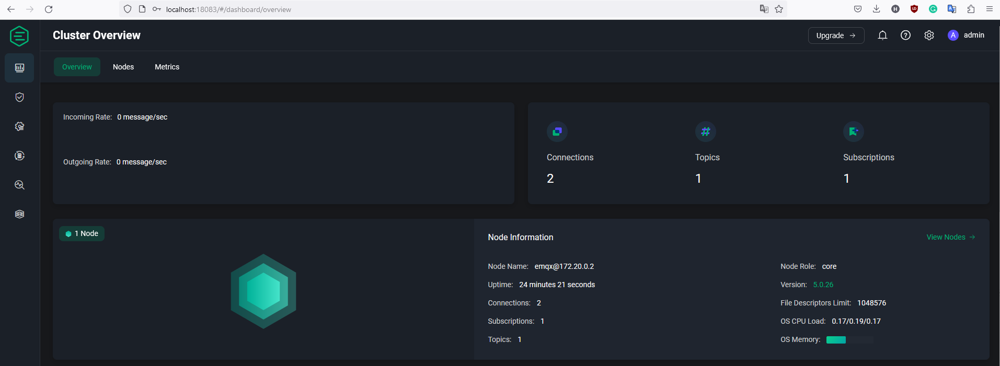

## MQTT Sample project
This project contains four components: a database, an MQTT broker, an `mqtt_app` that acts both as a publisher and subscriber to the broker, and an `api` that gets all data from the database.

Below is a simple diagram showcasing the high-level overview of the project:


## Quick start
Prerequisites: Need to make the entry point script of the API executable. From the project root directory:

`chmod +x ./api/entrypoint.sh`

All components of the project can be run as containers using the command:

`docker compose up -d`

The result will be shown as follows:


To view the apps' logs, use the command:

`docker compose logs -f web mqtt_app`

The below figure is an example of the result:


The API's Swagger ui can be viewed on `http://localhost:8000/docs`


The broker can be viewed on `http://localhost:18083` with default username `admin` and password `public`

The below figure is an example of the EMQX broker dashboard:



The DB container can be simply viewed by executing the commands:
``` bash
# Get an interactive console in db container.
docker compose exec db bash
# Connect to mysql and use the database named "testing"
mysql -uroot --password=$MYSQL_ROOT_PASSWORD -D testing
# Show all tables
SHOW TABLES;
# View all charger sessions:
SELECT * FROM charger_sessions;
```

The below figure shows an example of the flow above:


## Tweaks
To modify and re-run the `mqtt_app`, use the command:

`docker compose up --build mqtt_app`

To modify and re-run the `api`, use the command:

`docker compose up --build web`

In the docker-compose file, the following environment variables can be tweaked:

`web`
- `DB_URL` The database connection string. The DBAPI used must be an asyncio version and the driver package must be added to `api/requirements.txt`

`mqtt_app`
- `DB_URL` The database connection string. The driver package must be added to `mqtt_app/requirements.txt`
- `BROKER_ADDR` The hostname or IP address of the remote MQTT broker
- `DEBUG_PRINT` Remove this if don't want to see the MQTT thread logs

## FAQ
Q: Can't run `api` due to error: `entrypoint.sh: operation not permitted` on Mac?
- First, make sure you make the file executable.
- Second, [grant disc access to Docker](https://stackoverflow.com/questions/58482352/operation-not-permitted-from-docker-container-logged-as-root).
